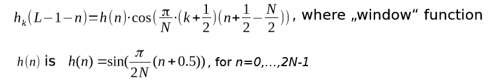

# audioCodec
 A class to encode and decode wav file using filter banks and psychoacoustic models

# model


# MDCT
 MDCT: "modulated filter" is described by following function



# requirements
* [**numpy**](https://www.numpy.org)
* ~~[**scipy**](https://www.scipy.org) (dependencies on scipy will be removed)~~ removed

# usage
```python
from audioCodec import codec

wavFile = 't16.wav' # input audio file
outBin = 'out.bin' # binary file name to store quantized signal in
outWav = 'reconstructed.wav' # wav file name for reconstricted signal
alpha=1. # tonality index
nSubband=256 # number of filter bank subbands "taps"

myObj = codec(wavFile,alpha,nSubband)

myObj.applyAnalyzer() # apply analyzer

myObj.binaryWrite(outBin) # write analyzed frames into a  binary file

myObj.applyPsychoacoustic() # apply psychoacoustic analysis on the signal to get the quantization steps

myObj.quantize() # quantize the signal with quantization steps from psychoacoustic analysis

myObj.dequantize() # dequantize the signal using quantization steps recovered from the scaleFactors
#Scale factors are the representation of the quantization steps in Bark domain, I used them as the are lower and make more sense to transmit them instead of the whole quantization matrix.

myObj.applySynthesiser() # apply synthesiser

myObj.wavWrite(outWav) # write synthesised frames into a wav file


```
# attributes
```python
myObj.samplingRate # sampling rate of input file
myObj.mode # input file mode "mono or stereo"
myObj.frames # frames "samples" of input file
myObj.nFrames # number of frames in input file
myObj.filterLength # filter bank length
myObj.filterBank # filter bank coefficients " impluse response"
myObj.analyzedFrame # get the analyzed signal 
myObj.reconsctucedSignal # output after reconstruction

```

# todo
* add low latency filter banks
* ~~add psychoacoustic~~
* ~~add quantization~~
* ~~remove scipy~~
* redo the stereo/mono part with a better approach
* add jupyter notebook with better explanation

## License

This work is licensed under a Creative Commons Attribution-NonCommercial 4.0 International License, which allows for personal and research use only. For a commercial license please contact the authors. You can view a license summary here: http://creativecommons.org/licenses/by-nc/4.0/
