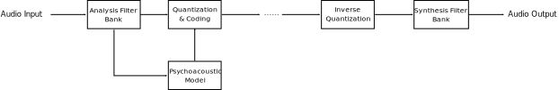

# audioCodec
 A class to encode and decode wav file using filter banks and psychoacoustic models

# model


# requirements
* [**numpy**](https://www.numpy.org)
* ~~[**scipy**](https://www.scipy.org) (dependencies on scipy will be removed)~~ removed

# usage
```python
from audioCodec import codec

wavFile = 't16.wav' # input audio file
outBin = 'out.bin' # binary file name to store quantized signal in
outWav = 'reconstructed.wav' # wav file name for reconstricted signal
alpha=1. # tonality index
nSubband=256 # number of filter bank subbands "taps"

myObj = codec(wavFile,outBin,outWav,alpha,nSubband)

myObj.applyAnalyzer() # apply analyzer
# myObj.analyzedFrame will get you can get the analyzed signal 

myObj.applySynthesiser() # apply synthesiser
myObj.reconsctucedSignal # to get the output after reconstruction

```
# attributes
```python
myObj.samplingRate # sampling rate of input file
myObj.mode # input file mode "mono or stereo"
myObj.frames # frames "samples" of input file
myObj.nFrames # number of frames in input file
myObj.filterLength # filter bank length
myObj.filterBank # filter bank coefficients " impluse response"
myObj.reconsctucedSignal # output after reconstruction
```

# todo
* add psychoacoustic
* add quantization
* ~~remove scipy~~

## License

This work is licensed under a Creative Commons Attribution-NonCommercial 4.0 International License, which allows for personal and research use only. For a commercial license please contact the authors. You can view a license summary here: http://creativecommons.org/licenses/by-nc/4.0/
